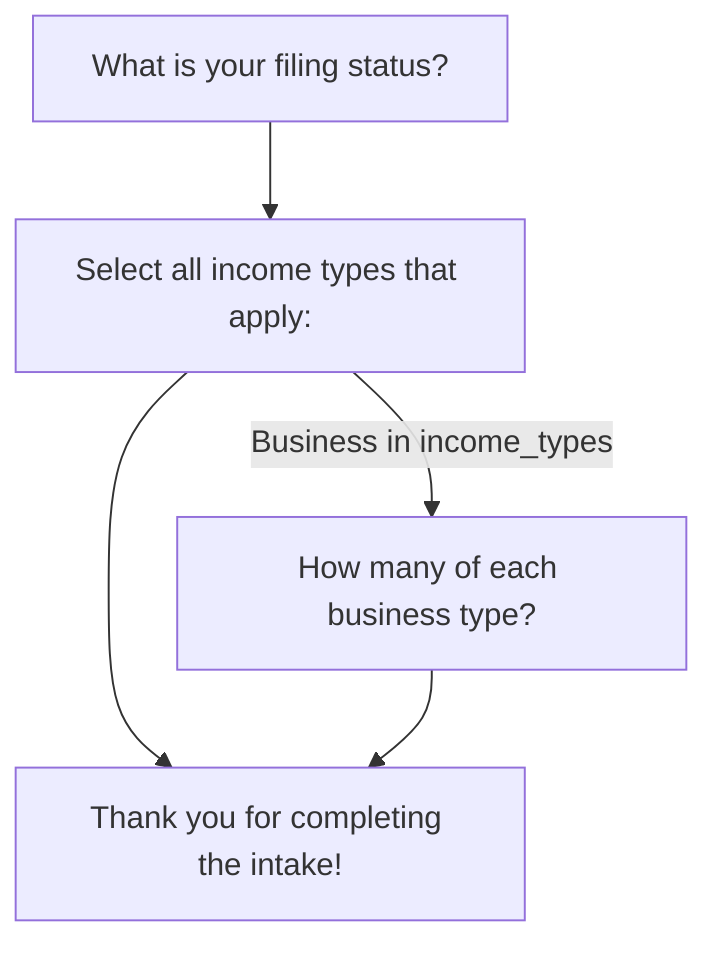

# FlowEngine CLI

[](https://github.com/kigster/flowengine-cli/actions/workflows/rspec.yml) [](https://github.com/kigster/flowengine-cli/actions/workflows/rubocop.yml)

Terminal-based interactive wizard runner for [FlowEngine](https://github.com/kigster/flowengine) flows. Define your flow once, run it in the terminal with rich TTY prompts, export Mermaid diagrams, and validate flow definitions -- all from the command line.

FlowEngine CLI is a UI adapter that sits on top of the pure-Ruby `flowengine` core gem. The core gem knows nothing about terminals, databases, or web frameworks. This gem provides the terminal interface.

## Table of Contents

- [Installation](#installation)
- [Quick Start](#quick-start)
- [Commands](#commands)
  - [`run` -- Interactive Wizard](#run----interactive-wizard)
  - [`graph` -- Export Mermaid Diagram](#graph----export-mermaid-diagram)
  - [`validate` -- Validate Flow Definition](#validate----validate-flow-definition)
  - [`version` -- Print Version](#version----print-version)
- [Step Types & TTY Rendering](#step-types--tty-rendering)
- [Flow Definition DSL](#flow-definition-dsl)
  - [Available Rules](#available-rules)
  - [Composing Rules](#composing-rules)
- [In-Depth Walkthrough: Tax Intake](#in-depth-walkthrough-tax-intake)
  - [The Flow Definition](#the-flow-definition)
  - [Scenario 1: Simple W2 Filer](#scenario-1-simple-w2-filer)
  - [Scenario 2: Business Owner with Crypto](#scenario-2-business-owner-with-crypto)
  - [Scenario 3: Married Investor with Rentals and Foreign Accounts](#scenario-3-married-investor-with-rentals-and-foreign-accounts)
  - [Scenario 4: Complex Multi-Business Filer with Charitable Donations](#scenario-4-complex-multi-business-filer-with-charitable-donations)
- [In-Depth Walkthrough: Customer Onboarding](#in-depth-walkthrough-customer-onboarding)
- [Graph Visualization Examples](#graph-visualization-examples)
- [Architecture](#architecture)
- [Development](#development)
- [Contributing](#contributing)
- [License](#license)

## Installation

Add to your Gemfile:

```ruby
gem "flowengine-cli"
```

Or install directly:

```bash
gem install flowengine-cli
```

### Requirements

- Ruby >= 4.0.1
- [flowengine](https://github.com/kigster/flowengine) ~> 0.1

## Quick Start

### 1. Define a flow

Create a file called `intake.rb`:

```ruby
FlowEngine.define do
  start :filing_status

  step :filing_status do
    type :single_select
    question "What is your filing status?"
    options %w[Single Married HeadOfHousehold]
    transition to: :income_types
  end

  step :income_types do
    type :multi_select
    question "Select all income types that apply:"
    options %w[W2 1099 Business Investment Rental]
    transition to: :business_details, if_rule: contains(:income_types, "Business")
    transition to: :summary
  end

  step :business_details do
    type :number_matrix
    question "How many of each business type?"
    fields %w[LLC SCorp CCorp]
    transition to: :summary
  end

  step :summary do
    type :display
    question "Thank you for completing the intake!"
  end
end
```

### 2. Run it

```bash
flowengine-cli run intake.rb
```

The CLI walks you through each step interactively, rendering the appropriate TTY prompt for each step type. When complete, it outputs the collected answers as JSON.

### 3. Save results to a file

```bash
flowengine-cli run intake.rb -o results.json
```

## Commands

### `run` -- Interactive Wizard

```bash
flowengine-cli run <flow_file.rb> [-o output.json]
```

Loads a flow definition, presents each step as an interactive terminal prompt, and outputs the collected answers as JSON when complete.

**Arguments:**
| Argument | Required | Description |
|----------|----------|-------------|
| `flow_file` | Yes | Path to a `.rb` file containing a `FlowEngine.define` block |

**Options:**
| Option | Alias | Description |
|--------|-------|-------------|
| `--output` | `-o` | Write JSON results to this file |

**What happens at runtime:**

```
┏━━━━━━━━━━━━━━━━━━━━━━━━━━━━━━━━━━━━━━━━━━━━━━━━━━━━━━━━━━━━━━━━┓
┃                FlowEngine Interactive Wizard                    ┃
┗━━━━━━━━━━━━━━━━━━━━━━━━━━━━━━━━━━━━━━━━━━━━━━━━━━━━━━━━━━━━━━━━┛

  Step 1: filing_status
  ────────────────────────────────────────
  What is your filing status? (Use ↑/↓ arrow keys, press Enter to select)
  > Single
    Married
    HeadOfHousehold

  Step 2: income_types
  ────────────────────────────────────────
  Select all income types that apply: (Use ↑/↓ arrow keys, press Space to select)
    ◯ W2
  > ◉ 1099
    ◉ Business
    ◯ Investment
    ◯ Rental

  Step 3: business_details
  ────────────────────────────────────────
  How many of each business type?

    LLC: 2
    SCorp: 1
    CCorp: 0

  Step 4: summary
  ────────────────────────────────────────

  Thank you for completing the intake!
  Press any key to continue...

┌ SUCCESS ─────────────────────────────────────────────────────────┐
│                      Flow completed!                             │
└──────────────────────────────────────────────────────────────────┘
```

Then the JSON output is printed to stdout (and optionally saved to a file):

```json
{
  "flow_file": "intake.rb",
  "path_taken": ["filing_status", "income_types", "business_details", "summary"],
  "answers": {
    "filing_status": "Single",
    "income_types": ["1099", "Business"],
    "business_details": { "LLC": 2, "SCorp": 1, "CCorp": 0 },
    "summary": null
  },
  "steps_completed": 4,
  "completed_at": "2026-02-26T20:15:00-08:00"
}
```

> **Note:** Display steps (like `summary`) record `null` in the answers since they are informational only.

---

### `graph` -- Export Mermaid Diagram

```bash
flowengine-cli graph <flow_file.rb> [-o diagram.mmd]
```

Exports the flow definition as a [Mermaid](https://mermaid.js.org/) flowchart diagram. Useful for documentation, visualization, and reviewing flow logic.

**Options:**
| Option | Alias | Description |
|--------|-------|-------------|
| `--output` | `-o` | Write diagram to file (default: stdout) |
| `--format` | | Output format (default: `mermaid`) |

**Example:**

```bash
flowengine-cli graph intake.rb
```

Outputs:



Save to a file and render with any Mermaid-compatible tool (GitHub, VS Code, mermaid.live):

```bash
flowengine-cli graph intake.rb -o flow.mmd
# => Diagram written to flow.mmd
```

---

### `validate` -- Validate Flow Definition

```bash
flowengine-cli validate <flow_file.rb>
```

Validates a flow definition file for structural correctness. Checks for:

- **Start step existence** -- is the declared start step defined?
- **Transition targets** -- do all transitions point to steps that exist?
- **Reachability** -- are there orphan steps unreachable from the start?

**Example (valid flow):**

```bash
$ flowengine-cli validate intake.rb
Flow definition is valid!
  Start step: filing_status
  Total steps: 4
  Steps: filing_status, income_types, business_details, summary
```

**Example (flow with errors):**

```bash
$ flowengine-cli validate broken_flow.rb
Flow definition has errors:
  - Step :income_types has transition to unknown step :nonexistent
  - Step :orphan is unreachable from start step :filing_status
```

---

### `version` -- Print Version

```bash
$ flowengine-cli version
flowengine-cli 0.1.0
flowengine 0.1.0
```

## Step Types & TTY Rendering

The `Renderer` maps each `FlowEngine::Node` type to the appropriate [TTY::Prompt](https://github.com/piotrmurach/tty-prompt) widget:

| Step Type | DSL | TTY Widget | Returns |
|-----------|-----|------------|---------|
| `:single_select` | `type :single_select` | `prompt.select` | `String` |
| `:multi_select` | `type :multi_select` | `prompt.multi_select` (min: 1) | `Array<String>` |
| `:number_matrix` | `type :number_matrix` | `prompt.ask` per field (int) | `Hash<String, Integer>` |
| `:text` | `type :text` | `prompt.ask` | `String` |
| `:number` | `type :number` | `prompt.ask` (convert: int) | `Integer` |
| `:boolean` | `type :boolean` | `prompt.yes?` | `true` / `false` |
| `:display` | `type :display` | Prints text, waits for keypress | `nil` |

Unknown types fall back to `:text` rendering.

## Flow Definition DSL

Flow files are plain Ruby scripts that call `FlowEngine.define`. The full DSL is provided by the `flowengine` core gem:

```ruby
FlowEngine.define do
  start :first_step                    # Required: declare entry point

  step :first_step do
    type :single_select                # Step type (see table above)
    question "Pick one:"               # Prompt text shown to user
    options %w[A B C]                  # Choices (for select types)
    fields %w[X Y Z]                   # Fields (for number_matrix)
    visible_if not_empty(:some_step)   # Optional: DAG visibility rule

    # Transitions (evaluated top-to-bottom, first match wins)
    transition to: :step_b, if_rule: equals(:first_step, "A")
    transition to: :step_c, if_rule: contains(:first_step, "B")
    transition to: :default_step       # Unconditional fallback
  end
end
```

### Available Rules

Rules are composable AST objects used in `if_rule:` and `visible_if`:

| Rule | DSL Helper | Evaluates |
|------|-----------|-----------|
| Contains | `contains(:step, "val")` | `Array(answers[:step]).include?("val")` |
| Equals | `equals(:step, "val")` | `answers[:step] == "val"` |
| GreaterThan | `greater_than(:step, 100)` | `answers[:step].to_i > 100` |
| LessThan | `less_than(:step, 5)` | `answers[:step].to_i < 5` |
| NotEmpty | `not_empty(:step)` | `answers[:step]` is not nil, "", or [] |
| All (AND) | `all(rule1, rule2)` | All sub-rules must be true |
| Any (OR) | `any(rule1, rule2)` | At least one sub-rule must be true |

### Composing Rules

```ruby
transition to: :special_path,
           if_rule: all(
             equals(:filing_status, "Married"),
             greater_than(:income, 100_000),
             any(
               contains(:income_types, "Business"),
               contains(:income_types, "Investment")
             )
           )
```

## In-Depth Walkthrough: Tax Intake

This section walks through a realistic 17-step tax preparation intake flow, showing four different user journeys through the same flow definition. Each scenario demonstrates different branching paths, and the resulting collected data.

### The Flow Definition

Save this as `tax_intake.rb`:

```ruby
FlowEngine.define do
  start :filing_status

  step :filing_status do
    type :single_select
    question "What is your filing status for 2025?"
    options %w[single married_filing_jointly married_filing_separately head_of_household]
    transition to: :dependents
  end

  step :dependents do
    type :number
    question "How many dependents do you have?"
    transition to: :income_types
  end

  step :income_types do
    type :multi_select
    question "Select all income types that apply to you in 2025."
    options %w[W2 1099 Business Investment Rental Retirement]
    transition to: :business_count, if_rule: contains(:income_types, "Business")
    transition to: :investment_details, if_rule: contains(:income_types, "Investment")
    transition to: :rental_details, if_rule: contains(:income_types, "Rental")
    transition to: :state_filing
  end

  step :business_count do
    type :number
    question "How many total businesses do you own or are a partner in?"
    transition to: :complex_business_info, if_rule: greater_than(:business_count, 2)
    transition to: :business_details
  end

  step :complex_business_info do
    type :text
    question "With more than 2 businesses, please provide your primary EIN and a brief description."
    transition to: :business_details
  end

  step :business_details do
    type :number_matrix
    question "How many of each business type do you own?"
    fields %w[RealEstate SCorp CCorp Trust LLC]
    transition to: :investment_details, if_rule: contains(:income_types, "Investment")
    transition to: :rental_details, if_rule: contains(:income_types, "Rental")
    transition to: :state_filing
  end

  step :investment_details do
    type :multi_select
    question "What types of investments do you hold?"
    options %w[Stocks Bonds Crypto RealEstate MutualFunds]
    transition to: :crypto_details, if_rule: contains(:investment_details, "Crypto")
    transition to: :rental_details, if_rule: contains(:income_types, "Rental")
    transition to: :state_filing
  end

  step :crypto_details do
    type :text
    question "Describe your cryptocurrency transactions (exchanges, approximate transaction count)."
    transition to: :rental_details, if_rule: contains(:income_types, "Rental")
    transition to: :state_filing
  end

  step :rental_details do
    type :number_matrix
    question "Provide details about your rental properties."
    fields %w[Residential Commercial Vacation]
    transition to: :state_filing
  end

  step :state_filing do
    type :multi_select
    question "Which states do you need to file in?"
    options %w[California NewYork Texas Florida Illinois Other]
    transition to: :foreign_accounts
  end

  step :foreign_accounts do
    type :single_select
    question "Do you have any foreign financial accounts?"
    options %w[yes no]
    transition to: :foreign_account_details, if_rule: equals(:foreign_accounts, "yes")
    transition to: :deduction_types
  end

  step :foreign_account_details do
    type :number
    question "How many foreign accounts do you have?"
    transition to: :deduction_types
  end

  step :deduction_types do
    type :multi_select
    question "Which additional deductions apply to you?"
    options %w[Medical Charitable Education Mortgage None]
    transition to: :charitable_amount, if_rule: contains(:deduction_types, "Charitable")
    transition to: :contact_info
  end

  step :charitable_amount do
    type :number
    question "What is your total estimated charitable contribution amount for 2025?"
    transition to: :charitable_documentation, if_rule: greater_than(:charitable_amount, 5000)
    transition to: :contact_info
  end

  step :charitable_documentation do
    type :text
    question "For contributions over $5,000, please list the organizations and amounts."
    transition to: :contact_info
  end

  step :contact_info do
    type :text
    question "Please provide your contact information (name, email, phone)."
    transition to: :review
  end

  step :review do
    type :display
    question "Thank you! Your intake is complete. We will be in touch shortly."
  end
end
```

Now let's see how four different users travel through this flow, and what the collected data looks like for each.

---

### Scenario 1: Simple W2 Filer

A single person with only W2 income, no investments, no businesses -- the simplest path.

**Terminal session:**

```
┏━━━━━━━━━━━━━━━━━━━━━━━━━━━━━━━━━━━━━━━━━━━━━━━━━━━━━━━━━━━━━━━━┓
┃                FlowEngine Interactive Wizard                    ┃
┗━━━━━━━━━━━━━━━━━━━━━━━━━━━━━━━━━━━━━━━━━━━━━━━━━━━━━━━━━━━━━━━━┛

  Step 1: filing_status
  ────────────────────────────────────────
  What is your filing status for 2025?
  > single
    married_filing_jointly
    married_filing_separately
    head_of_household

  Step 2: dependents
  ────────────────────────────────────────
  How many dependents do you have? 0

  Step 3: income_types
  ────────────────────────────────────────
  Select all income types that apply to you in 2025.
  > ◉ W2
    ◯ 1099
    ◯ Business
    ◯ Investment
    ◯ Rental
    ◯ Retirement

  Step 4: state_filing
  ────────────────────────────────────────
  Which states do you need to file in?
  > ◉ California
    ◯ NewYork
    ◯ Texas
    ◯ Florida
    ◯ Illinois
    ◯ Other

  Step 5: foreign_accounts
  ────────────────────────────────────────
  Do you have any foreign financial accounts?
    yes
  > no

  Step 6: deduction_types
  ────────────────────────────────────────
  Which additional deductions apply to you?
    ◯ Medical
    ◯ Charitable
    ◯ Education
    ◯ Mortgage
  > ◉ None

  Step 7: contact_info
  ────────────────────────────────────────
  Please provide your contact information (name, email, phone).
  Jane Smith, jane@example.com, 415-555-1234

  Step 8: review
  ────────────────────────────────────────

  Thank you! Your intake is complete. We will be in touch shortly.
  Press any key to continue...

┌ SUCCESS ─────────────────────────────────────────────────────────┐
│                      Flow completed!                             │
└──────────────────────────────────────────────────────────────────┘
```

**Collected data (`-o simple_w2.json`):**

```json
{
  "flow_file": "tax_intake.rb",
  "path_taken": [
    "filing_status",
    "dependents",
    "income_types",
    "state_filing",
    "foreign_accounts",
    "deduction_types",
    "contact_info",
    "review"
  ],
  "answers": {
    "filing_status": "single",
    "dependents": 0,
    "income_types": ["W2"],
    "state_filing": ["California"],
    "foreign_accounts": "no",
    "deduction_types": ["None"],
    "contact_info": "Jane Smith, jane@example.com, 415-555-1234",
    "review": null
  },
  "steps_completed": 8,
  "completed_at": "2026-02-26T14:30:00-08:00"
}
```

**Steps skipped:** `business_count`, `complex_business_info`, `business_details`, `investment_details`, `crypto_details`, `rental_details`, `foreign_account_details`, `charitable_amount`, `charitable_documentation` -- 9 of 17 steps skipped because the user's answers didn't trigger those branches.

---

### Scenario 2: Business Owner with Crypto

A single person who owns 1 business and has crypto investments.

**Terminal session:**

```
┏━━━━━━━━━━━━━━━━━━━━━━━━━━━━━━━━━━━━━━━━━━━━━━━━━━━━━━━━━━━━━━━━┓
┃                FlowEngine Interactive Wizard                    ┃
┗━━━━━━━━━━━━━━━━━━━━━━━━━━━━━━━━━━━━━━━━━━━━━━━━━━━━━━━━━━━━━━━━┛

  Step 1: filing_status
  ────────────────────────────────────────
  What is your filing status for 2025?
  > single

  Step 2: dependents
  ────────────────────────────────────────
  How many dependents do you have? 0

  Step 3: income_types
  ────────────────────────────────────────
  Select all income types that apply to you in 2025.
    ◉ W2
    ◯ 1099
  > ◉ Business
    ◉ Investment
    ◯ Rental
    ◯ Retirement

  Step 4: business_count
  ────────────────────────────────────────
  How many total businesses do you own or are a partner in? 1

  Step 5: business_details
  ────────────────────────────────────────
  How many of each business type do you own?

    RealEstate: 0
    SCorp: 0
    CCorp: 0
    Trust: 0
    LLC: 1

  Step 6: investment_details
  ────────────────────────────────────────
  What types of investments do you hold?
    ◉ Stocks
    ◯ Bonds
  > ◉ Crypto
    ◯ RealEstate
    ◯ MutualFunds

  Step 7: crypto_details
  ────────────────────────────────────────
  Describe your cryptocurrency transactions (exchanges, approximate transaction count).
  Coinbase and Kraken, approximately 150 trades in 2025

  Step 8: state_filing
  ────────────────────────────────────────
  Which states do you need to file in?
  > ◉ California
    ◯ NewYork
    ◯ Texas
    ◯ Florida
    ◯ Illinois
    ◯ Other

  Step 9: foreign_accounts
  ────────────────────────────────────────
  Do you have any foreign financial accounts?
    yes
  > no

  Step 10: deduction_types
  ────────────────────────────────────────
  Which additional deductions apply to you?
    ◯ Medical
    ◯ Charitable
    ◯ Education
    ◯ Mortgage
  > ◉ None

  Step 11: contact_info
  ────────────────────────────────────────
  Please provide your contact information (name, email, phone).
  Alex Rivera, alex@startup.io, 510-555-9876

  Step 12: review
  ────────────────────────────────────────

  Thank you! Your intake is complete. We will be in touch shortly.
  Press any key to continue...

┌ SUCCESS ─────────────────────────────────────────────────────────┐
│                      Flow completed!                             │
└──────────────────────────────────────────────────────────────────┘
```

**Collected data (`-o business_crypto.json`):**

```json
{
  "flow_file": "tax_intake.rb",
  "path_taken": [
    "filing_status",
    "dependents",
    "income_types",
    "business_count",
    "business_details",
    "investment_details",
    "crypto_details",
    "state_filing",
    "foreign_accounts",
    "deduction_types",
    "contact_info",
    "review"
  ],
  "answers": {
    "filing_status": "single",
    "dependents": 0,
    "income_types": ["W2", "Business", "Investment"],
    "business_count": 1,
    "business_details": {
      "RealEstate": 0,
      "SCorp": 0,
      "CCorp": 0,
      "Trust": 0,
      "LLC": 1
    },
    "investment_details": ["Stocks", "Crypto"],
    "crypto_details": "Coinbase and Kraken, approximately 150 trades in 2025",
    "state_filing": ["California"],
    "foreign_accounts": "no",
    "deduction_types": ["None"],
    "contact_info": "Alex Rivera, alex@startup.io, 510-555-9876",
    "review": null
  },
  "steps_completed": 12,
  "completed_at": "2026-02-26T15:45:00-08:00"
}
```

Notice how selecting "Business" at `income_types` triggered the `business_count` -> `business_details` branch, and selecting "Investment" continued the flow into `investment_details`. Since the user selected "Crypto" there, the `crypto_details` step was reached. The engine evaluated transitions top-to-bottom, taking the first match.

---

### Scenario 3: Married Investor with Rentals and Foreign Accounts

A married person filing jointly, with investments, rental properties, and foreign bank accounts.

**Collected data (`-o married_investor.json`):**

```json
{
  "flow_file": "tax_intake.rb",
  "path_taken": [
    "filing_status",
    "dependents",
    "income_types",
    "investment_details",
    "rental_details",
    "state_filing",
    "foreign_accounts",
    "foreign_account_details",
    "deduction_types",
    "charitable_amount",
    "contact_info",
    "review"
  ],
  "answers": {
    "filing_status": "married_filing_jointly",
    "dependents": 2,
    "income_types": ["W2", "Investment", "Rental"],
    "investment_details": ["Stocks", "Bonds", "MutualFunds"],
    "rental_details": {
      "Residential": 2,
      "Commercial": 0,
      "Vacation": 1
    },
    "state_filing": ["California", "NewYork"],
    "foreign_accounts": "yes",
    "foreign_account_details": 3,
    "deduction_types": ["Medical", "Charitable", "Mortgage"],
    "charitable_amount": 3500,
    "contact_info": "Maria & Carlos Reyes, reyes@email.com, 212-555-4567",
    "review": null
  },
  "steps_completed": 12,
  "completed_at": "2026-02-26T16:20:00-08:00"
}
```

Key branching decisions in this path:

1. **`income_types`** -- No "Business" was selected, so `business_count`/`business_details` were skipped entirely. "Investment" was the first matching rule, so the flow went to `investment_details`.
2. **`investment_details`** -- No "Crypto", but "Rental" was in `income_types`, so the flow continued to `rental_details`.
3. **`foreign_accounts`** -- User answered "yes", triggering the `foreign_account_details` step.
4. **`deduction_types`** -- "Charitable" was selected, activating the `charitable_amount` step. But the amount (3,500) was not greater than 5,000, so `charitable_documentation` was skipped.

---

### Scenario 4: Complex Multi-Business Filer with Charitable Donations

A head of household with 4 businesses, investments, rentals, foreign accounts, and over $5,000 in charitable giving -- the longest possible path through the flow.

**Collected data (`-o complex_filer.json`):**

```json
{
  "flow_file": "tax_intake.rb",
  "path_taken": [
    "filing_status",
    "dependents",
    "income_types",
    "business_count",
    "complex_business_info",
    "business_details",
    "investment_details",
    "crypto_details",
    "rental_details",
    "state_filing",
    "foreign_accounts",
    "foreign_account_details",
    "deduction_types",
    "charitable_amount",
    "charitable_documentation",
    "contact_info",
    "review"
  ],
  "answers": {
    "filing_status": "head_of_household",
    "dependents": 3,
    "income_types": ["W2", "1099", "Business", "Investment", "Rental", "Retirement"],
    "business_count": 4,
    "complex_business_info": "Primary EIN: 12-3456789. Two LLCs (consulting, real estate), one S-Corp (software), one C-Corp (manufacturing)",
    "business_details": {
      "RealEstate": 1,
      "SCorp": 1,
      "CCorp": 1,
      "Trust": 0,
      "LLC": 2
    },
    "investment_details": ["Stocks", "Bonds", "Crypto", "RealEstate", "MutualFunds"],
    "crypto_details": "Binance and Coinbase, ~400 transactions. Includes DeFi staking and NFT sales.",
    "rental_details": {
      "Residential": 3,
      "Commercial": 1,
      "Vacation": 0
    },
    "state_filing": ["California", "Texas", "Florida"],
    "foreign_accounts": "yes",
    "foreign_account_details": 5,
    "deduction_types": ["Medical", "Charitable", "Education", "Mortgage"],
    "charitable_amount": 12000,
    "charitable_documentation": "Red Cross $5,000; Habitat for Humanity $4,000; Local food bank $3,000",
    "contact_info": "David Park, dpark@enterprise.com, 650-555-8901",
    "review": null
  },
  "steps_completed": 17,
  "completed_at": "2026-02-26T17:05:00-08:00"
}
```

This user hit all 17 steps -- every branch was activated:

| Branch Trigger | Rule | Steps Activated |
|---|---|---|
| "Business" selected in `income_types` | `contains(:income_types, "Business")` | `business_count` |
| `business_count` > 2 | `greater_than(:business_count, 2)` | `complex_business_info` |
| "Investment" selected in `income_types` | `contains(:income_types, "Investment")` | `investment_details` |
| "Crypto" selected in `investment_details` | `contains(:investment_details, "Crypto")` | `crypto_details` |
| "Rental" selected in `income_types` | `contains(:income_types, "Rental")` | `rental_details` |
| "yes" for `foreign_accounts` | `equals(:foreign_accounts, "yes")` | `foreign_account_details` |
| "Charitable" selected in `deduction_types` | `contains(:deduction_types, "Charitable")` | `charitable_amount` |
| `charitable_amount` > 5000 | `greater_than(:charitable_amount, 5000)` | `charitable_documentation` |

---

### Comparing the Paths

| | Scenario 1 | Scenario 2 | Scenario 3 | Scenario 4 |
|---|---|---|---|---|
| **Persona** | Simple W2 | Business + Crypto | Married Investor | Complex Filer |
| **Steps completed** | 8 | 12 | 12 | 17 (all) |
| **Steps skipped** | 9 | 5 | 5 | 0 |
| **Business branch** | -- | Yes (1 biz) | -- | Yes (4 biz + complex) |
| **Investment branch** | -- | Yes | Yes | Yes |
| **Crypto sub-branch** | -- | Yes | -- | Yes |
| **Rental branch** | -- | -- | Yes | Yes |
| **Foreign accounts** | -- | -- | Yes | Yes |
| **Charitable branch** | -- | -- | Partial (< $5k) | Full (> $5k) |

## In-Depth Walkthrough: Customer Onboarding

Tax intake isn't the only use case. Here is a customer onboarding flow showing different step types.

Save as `onboarding.rb`:

```ruby
FlowEngine.define do
  start :welcome

  step :welcome do
    type :display
    question "Welcome to Acme Corp onboarding! We'll collect a few details to get you set up."
    transition to: :account_type
  end

  step :account_type do
    type :single_select
    question "What type of account are you creating?"
    options %w[Personal Business Enterprise]
    transition to: :company_info, if_rule: any(
      equals(:account_type, "Business"),
      equals(:account_type, "Enterprise")
    )
    transition to: :personal_info
  end

  step :company_info do
    type :text
    question "What is your company name?"
    transition to: :team_size
  end

  step :team_size do
    type :number
    question "How many team members will use the platform?"
    transition to: :features
  end

  step :personal_info do
    type :text
    question "What is your full name?"
    transition to: :features
  end

  step :features do
    type :multi_select
    question "Which features are you interested in?"
    options %w[Analytics Reporting API Integrations Support]
    transition to: :enterprise_sla, if_rule: all(
      equals(:account_type, "Enterprise"),
      contains(:features, "Support")
    )
    transition to: :confirm
  end

  step :enterprise_sla do
    type :boolean
    question "Do you require an SLA agreement?"
    transition to: :confirm
  end

  step :confirm do
    type :display
    question "All set! Your account will be provisioned shortly."
  end
end
```

**Run and save:**

```bash
flowengine-cli run onboarding.rb -o onboarding_result.json
```

**Example: Enterprise user who wants Support + SLA:**

```json
{
  "flow_file": "onboarding.rb",
  "path_taken": [
    "welcome",
    "account_type",
    "company_info",
    "team_size",
    "features",
    "enterprise_sla",
    "confirm"
  ],
  "answers": {
    "welcome": null,
    "account_type": "Enterprise",
    "company_info": "Globex Corporation",
    "team_size": 50,
    "features": ["Analytics", "API", "Support"],
    "enterprise_sla": true,
    "confirm": null
  },
  "steps_completed": 7,
  "completed_at": "2026-02-26T18:00:00-08:00"
}
```

**Example: Personal user:**

```json
{
  "flow_file": "onboarding.rb",
  "path_taken": [
    "welcome",
    "account_type",
    "personal_info",
    "features",
    "confirm"
  ],
  "answers": {
    "welcome": null,
    "account_type": "Personal",
    "personal_info": "Jordan Lee",
    "features": ["Analytics", "Reporting"],
    "confirm": null
  },
  "steps_completed": 5,
  "completed_at": "2026-02-26T18:05:00-08:00"
}
```

The Personal user skipped `company_info`, `team_size`, and `enterprise_sla` entirely -- those steps were never reached because the transition rules didn't match.

## Graph Visualization Examples

### Validate, then visualize

A typical workflow is to validate first, then export the graph:

```bash
$ flowengine-cli validate tax_intake.rb
Flow definition is valid!
  Start step: filing_status
  Total steps: 17
  Steps: filing_status, dependents, income_types, business_count,
         complex_business_info, business_details, investment_details,
         crypto_details, rental_details, state_filing, foreign_accounts,
         foreign_account_details, deduction_types, charitable_amount,
         charitable_documentation, contact_info, review

$ flowengine-cli graph tax_intake.rb -o tax_flow.mmd
Diagram written to tax_flow.mmd
```

### Full Mermaid diagram for tax intake

The exported Mermaid diagram for the 17-step tax intake:


Paste this into [mermaid.live](https://mermaid.live), a GitHub Markdown file, or any Mermaid-compatible renderer to see the flow as a visual graph.

## Architecture

```
                 +-------------------+
                 |    flowengine     |
                 |   (core gem)      |
                 |-------------------|
                 | DSL + Definition  |
                 | AST Rules         |
                 | Evaluator         |
                 | Engine Runtime    |
                 | Mermaid Exporter  |
                 +-------------------+
                          ^
                          |
              +-----------+-----------+
              |  flowengine-cli       |
              |-----------------------|
              | Dry::CLI commands     |
              | TTY::Prompt renderer  |
              | Flow file loader      |
              | JSON output           |
              +-----------------------+
```

The core `flowengine` gem has **zero UI dependencies**. It provides the DSL, rule evaluation, and engine runtime. This gem (`flowengine-cli`) is a thin adapter that:

1. **Loads** flow definitions from `.rb` files via `FlowLoader`
2. **Renders** each step type to the appropriate TTY::Prompt widget via `Renderer`
3. **Drives** the engine loop until completion
4. **Outputs** results as structured JSON

### JSON Output Structure

Every `run` command produces JSON with a consistent structure:

```json
{
  "flow_file": "path/to/flow.rb",
  "path_taken": ["step_a", "step_b", "step_c"],
  "answers": {
    "step_a": "<value depends on step type>",
    "step_b": "<value depends on step type>"
  },
  "steps_completed": 3,
  "completed_at": "2026-02-26T20:15:00-08:00"
}
```

| Field | Type | Description |
|-------|------|-------------|
| `flow_file` | `String` | The flow definition file that was executed |
| `path_taken` | `Array<String>` | Ordered list of step IDs the user visited |
| `answers` | `Hash` | Map of step ID to the user's answer (type varies by step) |
| `steps_completed` | `Integer` | Total number of steps the user went through |
| `completed_at` | `String` | ISO 8601 timestamp of when the flow finished |

**Answer types by step:**

| Step Type | Answer Type | Example |
|-----------|-------------|---------|
| `:single_select` | `String` | `"Married"` |
| `:multi_select` | `Array<String>` | `["W2", "Business"]` |
| `:number_matrix` | `Hash<String, Integer>` | `{"LLC": 2, "SCorp": 1}` |
| `:text` | `String` | `"Jane Smith, jane@example.com"` |
| `:number` | `Integer` | `42` |
| `:boolean` | `Boolean` | `true` |
| `:display` | `null` | `null` |

## Development

```bash
git clone https://github.com/kigster/flowengine-cli.git
cd flowengine-cli
bin/setup
bundle exec rspec
```

Tests use mocked `TTY::Prompt` instances so they run non-interactively. Coverage is enforced at 90% minimum via SimpleCov.

```bash
bundle exec rspec           # Run tests
bundle exec rubocop         # Lint
bundle exec rake            # Both
```

## Contributing

Bug reports and pull requests are welcome on [GitHub](https://github.com/kigster/flowengine-cli).

## License

The gem is available as open source under the terms of the [MIT License](https://opensource.org/licenses/MIT).
