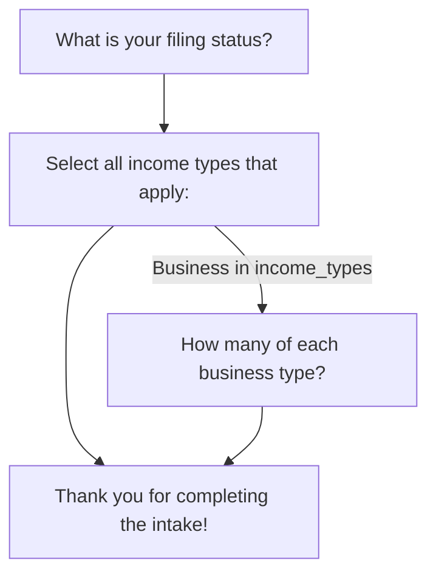
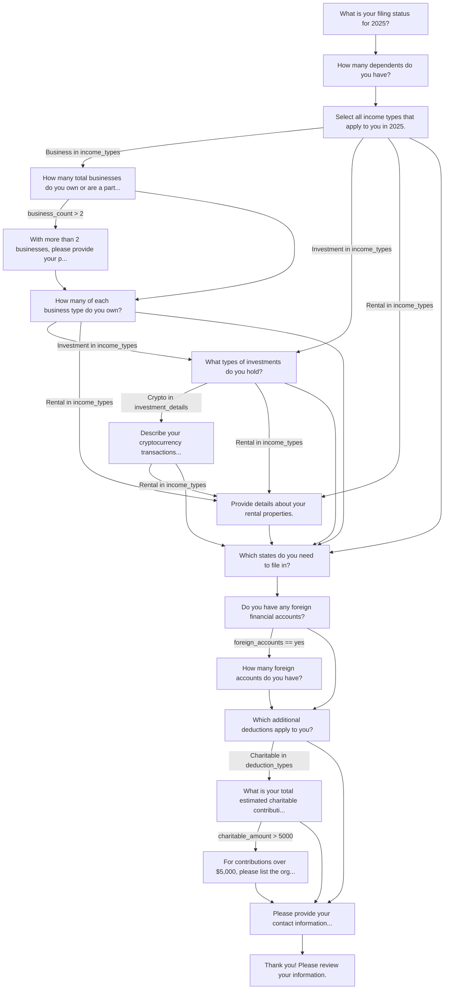

# FlowEngine CLI

Terminal-based interactive wizard runner for [FlowEngine](https://github.com/kigster/flowengine) flows. Define your flow once, run it in the terminal with rich TTY prompts, export Mermaid diagrams, and validate flow definitions -- all from the command line.

FlowEngine CLI is a UI adapter that sits on top of the pure-Ruby `flowengine` core gem. The core gem knows nothing about terminals, databases, or web frameworks. This gem provides the terminal interface.

## Installation

Add to your Gemfile:

```ruby
gem "flowengine-cli"
```

Or install directly:

```bash
gem install flowengine-cli
```

### Requirements

- Ruby >= 3.2.0
- [flowengine](https://github.com/kigster/flowengine) ~> 0.1

## Quick Start

### 1. Define a flow

Create a file called `intake.rb`:

```ruby
FlowEngine.define do
  start :filing_status

  step :filing_status do
    type :single_select
    question "What is your filing status?"
    options %w[Single Married HeadOfHousehold]
    transition to: :income_types
  end

  step :income_types do
    type :multi_select
    question "Select all income types that apply:"
    options %w[W2 1099 Business Investment Rental]
    transition to: :business_details, if_rule: contains(:income_types, "Business")
    transition to: :summary
  end

  step :business_details do
    type :number_matrix
    question "How many of each business type?"
    fields %w[LLC SCorp CCorp]
    transition to: :summary
  end

  step :summary do
    type :display
    question "Thank you for completing the intake!"
  end
end
```

### 2. Run it

```bash
flowengine-cli run intake.rb
```

The CLI walks you through each step interactively, rendering the appropriate TTY prompt for each step type. When complete, it outputs the collected answers as JSON:

```json
{
  "flow_file": "intake.rb",
  "path_taken": ["filing_status", "income_types", "business_details", "summary"],
  "answers": {
    "filing_status": "Married",
    "income_types": ["W2", "Business"],
    "business_details": { "LLC": 2, "SCorp": 1, "CCorp": 0 }
  },
  "steps_completed": 4,
  "completed_at": "2026-02-26T20:15:00-08:00"
}
```

### 3. Save results to a file

```bash
flowengine-cli run intake.rb -o results.json
```

## Commands

### `run` -- Interactive Wizard

```bash
flowengine-cli run <flow_file.rb> [-o output.json]
```

Loads a flow definition, presents each step as an interactive terminal prompt, and outputs the collected answers as JSON when complete.

**Arguments:**
| Argument | Required | Description |
|----------|----------|-------------|
| `flow_file` | Yes | Path to a `.rb` file containing a `FlowEngine.define` block |

**Options:**
| Option | Alias | Description |
|--------|-------|-------------|
| `--output` | `-o` | Write JSON results to this file |

**What happens at runtime:**

```
┏━━━━━━━━━━━━━━━━━━━━━━━━━━━━━━━━━━━━━━━━━━━━━━━━━━━━━━━━━━━━━━━━┓
┃                FlowEngine Interactive Wizard                     ┃
┗━━━━━━━━━━━━━━━━━━━━━━━━━━━━━━━━━━━━━━━━━━━━━━━━━━━━━━━━━━━━━━━━━┛

  Step 1: filing_status
  ────────────────────────────────────
  What is your filing status? (Use ↑/↓ arrow keys, press Enter to select)
  > Single
    Married
    HeadOfHousehold

  Step 2: income_types
  ────────────────────────────────────
  Select all income types that apply: (Use ↑/↓ arrow keys, press Space to select)
    ◯ W2
  > ◉ 1099
    ◉ Business
    ◯ Investment
    ◯ Rental

  Step 3: business_details
  ────────────────────────────────────
  How many of each business type?

    LLC: 2
    SCorp: 1
    CCorp: 0

┌ SUCCESS ─────────────────────────────────────────────────────────┐
│                      Flow completed!                             │
└──────────────────────────────────────────────────────────────────┘
{ ... JSON output ... }
```

---

### `graph` -- Export Mermaid Diagram

```bash
flowengine-cli graph <flow_file.rb> [-o diagram.mmd]
```

Exports the flow definition as a [Mermaid](https://mermaid.js.org/) flowchart diagram. Useful for documentation, visualization, and reviewing flow logic.

**Options:**
| Option | Alias | Description |
|--------|-------|-------------|
| `--output` | `-o` | Write diagram to file (default: stdout) |
| `--format` | | Output format (default: `mermaid`) |

**Example:**

```bash
flowengine-cli graph intake.rb
```

Outputs:



Save to a file and render with any Mermaid-compatible tool (GitHub, VS Code, mermaid.live):

```bash
flowengine-cli graph intake.rb -o flow.mmd
```

---

### `validate` -- Validate Flow Definition

```bash
flowengine-cli validate <flow_file.rb>
```

Validates a flow definition file for structural correctness. Checks for:

- **Start step existence** -- is the declared start step defined?
- **Transition targets** -- do all transitions point to steps that exist?
- **Reachability** -- are there orphan steps unreachable from the start?

**Example (valid flow):**

```bash
$ flowengine-cli validate intake.rb
Flow definition is valid!
  Start step: filing_status
  Total steps: 4
  Steps: filing_status, income_types, business_details, summary
```

**Example (flow with errors):**

```bash
$ flowengine-cli validate broken_flow.rb
Flow definition has errors:
  - Step :income_types has transition to unknown step :nonexistent
  - Step :orphan is unreachable from start step :filing_status
```

---

### `version` -- Print Version

```bash
$ flowengine-cli version
flowengine-cli 0.1.0
flowengine 0.1.0
```

## Step Types & TTY Rendering

The `Renderer` maps each `FlowEngine::Node` type to the appropriate [TTY::Prompt](https://github.com/piotrmurach/tty-prompt) widget:

| Step Type | DSL | TTY Widget | Returns |
|-----------|-----|------------|---------|
| `:single_select` | `type :single_select` | `prompt.select` | `String` |
| `:multi_select` | `type :multi_select` | `prompt.multi_select` (min: 1) | `Array<String>` |
| `:number_matrix` | `type :number_matrix` | `prompt.ask` per field (int) | `Hash<String, Integer>` |
| `:text` | `type :text` | `prompt.ask` | `String` |
| `:number` | `type :number` | `prompt.ask` (convert: int) | `Integer` |
| `:boolean` | `type :boolean` | `prompt.yes?` | `true` / `false` |
| `:display` | `type :display` | Prints text, waits for keypress | `nil` |

Unknown types fall back to `:text` rendering.

## Flow Definition DSL

Flow files are plain Ruby scripts that call `FlowEngine.define`. The full DSL is provided by the `flowengine` core gem:

```ruby
FlowEngine.define do
  start :first_step                    # Required: declare entry point

  step :first_step do
    type :single_select                # Step type (see table above)
    question "Pick one:"               # Prompt text shown to user
    options %w[A B C]                  # Choices (for select types)
    fields %w[X Y Z]                   # Fields (for number_matrix)
    visible_if not_empty(:some_step)   # Optional: DAG visibility rule

    # Transitions (evaluated top-to-bottom, first match wins)
    transition to: :step_b, if_rule: equals(:first_step, "A")
    transition to: :step_c, if_rule: contains(:first_step, "B")
    transition to: :default_step       # Unconditional fallback
  end
end
```

### Available Rules

Rules are composable AST objects used in `if_rule:` and `visible_if`:

| Rule | DSL Helper | Evaluates |
|------|-----------|-----------|
| Contains | `contains(:step, "val")` | `Array(answers[:step]).include?("val")` |
| Equals | `equals(:step, "val")` | `answers[:step] == "val"` |
| GreaterThan | `greater_than(:step, 100)` | `answers[:step].to_i > 100` |
| LessThan | `less_than(:step, 5)` | `answers[:step].to_i < 5` |
| NotEmpty | `not_empty(:step)` | `answers[:step]` is not nil, "", or [] |
| All (AND) | `all(rule1, rule2)` | All sub-rules must be true |
| Any (OR) | `any(rule1, rule2)` | At least one sub-rule must be true |

### Composing Rules

```ruby
transition to: :special_path,
           if_rule: all(
             equals(:filing_status, "Married"),
             greater_than(:income, 100_000),
             any(
               contains(:income_types, "Business"),
               contains(:income_types, "Investment")
             )
           )
```

## Full Example: Tax Intake Flow

Here is a realistic 17-step tax preparation intake flow demonstrating conditional branching, composite rules, and multiple paths:

```ruby
# tax_intake.rb
FlowEngine.define do
  start :filing_status

  step :filing_status do
    type :single_select
    question "What is your filing status for 2025?"
    options %w[single married_filing_jointly married_filing_separately head_of_household]
    transition to: :dependents
  end

  step :dependents do
    type :number
    question "How many dependents do you have?"
    transition to: :income_types
  end

  step :income_types do
    type :multi_select
    question "Select all income types that apply to you in 2025."
    options %w[W2 1099 Business Investment Rental Retirement]
    transition to: :business_count, if_rule: contains(:income_types, "Business")
    transition to: :investment_details, if_rule: contains(:income_types, "Investment")
    transition to: :rental_details, if_rule: contains(:income_types, "Rental")
    transition to: :state_filing
  end

  step :business_count do
    type :number
    question "How many total businesses do you own or are a partner in?"
    transition to: :complex_business_info, if_rule: greater_than(:business_count, 2)
    transition to: :business_details
  end

  step :complex_business_info do
    type :text
    question "With more than 2 businesses, please provide your primary EIN and a brief description."
    transition to: :business_details
  end

  step :business_details do
    type :number_matrix
    question "How many of each business type do you own?"
    fields %w[RealEstate SCorp CCorp Trust LLC]
    transition to: :investment_details, if_rule: contains(:income_types, "Investment")
    transition to: :rental_details, if_rule: contains(:income_types, "Rental")
    transition to: :state_filing
  end

  step :investment_details do
    type :multi_select
    question "What types of investments do you hold?"
    options %w[Stocks Bonds Crypto RealEstate MutualFunds]
    transition to: :crypto_details, if_rule: contains(:investment_details, "Crypto")
    transition to: :rental_details, if_rule: contains(:income_types, "Rental")
    transition to: :state_filing
  end

  step :crypto_details do
    type :text
    question "Describe your cryptocurrency transactions (exchanges, approximate transaction count)."
    transition to: :rental_details, if_rule: contains(:income_types, "Rental")
    transition to: :state_filing
  end

  step :rental_details do
    type :number_matrix
    question "Provide details about your rental properties."
    fields %w[Residential Commercial Vacation]
    transition to: :state_filing
  end

  step :state_filing do
    type :multi_select
    question "Which states do you need to file in?"
    options %w[California NewYork Texas Florida Illinois Other]
    transition to: :foreign_accounts
  end

  step :foreign_accounts do
    type :single_select
    question "Do you have any foreign financial accounts?"
    options %w[yes no]
    transition to: :foreign_account_details, if_rule: equals(:foreign_accounts, "yes")
    transition to: :deduction_types
  end

  step :foreign_account_details do
    type :number
    question "How many foreign accounts do you have?"
    transition to: :deduction_types
  end

  step :deduction_types do
    type :multi_select
    question "Which additional deductions apply to you?"
    options %w[Medical Charitable Education Mortgage None]
    transition to: :charitable_amount, if_rule: contains(:deduction_types, "Charitable")
    transition to: :contact_info
  end

  step :charitable_amount do
    type :number
    question "What is your total estimated charitable contribution amount for 2025?"
    transition to: :charitable_documentation, if_rule: greater_than(:charitable_amount, 5000)
    transition to: :contact_info
  end

  step :charitable_documentation do
    type :text
    question "For contributions over $5,000, please list the organizations and amounts."
    transition to: :contact_info
  end

  step :contact_info do
    type :text
    question "Please provide your contact information (name, email, phone)."
    transition to: :review
  end

  step :review do
    type :text
    question "Thank you! Please review your information. Type 'confirm' to submit."
  end
end
```

Run it:

```bash
flowengine-cli run tax_intake.rb -o tax_results.json
```

Visualize it:

```bash
flowengine-cli graph tax_intake.rb -o tax_flow.mmd
```

The Mermaid output renders as:



## Architecture

```
                 +-------------------+
                 |    flowengine     |
                 |   (core gem)      |
                 |-------------------|
                 | DSL + Definition  |
                 | AST Rules         |
                 | Evaluator         |
                 | Engine Runtime    |
                 | Mermaid Exporter  |
                 +-------------------+
                          ^
                          |
              +-----------+-----------+
              |  flowengine-cli       |
              |-----------------------|
              | Dry::CLI commands     |
              | TTY::Prompt renderer  |
              | Flow file loader      |
              | JSON output           |
              +-----------------------+
```

The core `flowengine` gem has **zero UI dependencies**. It provides the DSL, rule evaluation, and engine runtime. This gem (`flowengine-cli`) is a thin adapter that:

1. **Loads** flow definitions from `.rb` files via `FlowLoader`
2. **Renders** each step type to the appropriate TTY::Prompt widget via `Renderer`
3. **Drives** the engine loop until completion
4. **Outputs** results as structured JSON

## Development

```bash
git clone https://github.com/kigster/flowengine-cli.git
cd flowengine-cli
bin/setup
bundle exec rspec
```

Tests use mocked `TTY::Prompt` instances so they run non-interactively. Coverage is enforced at 90% minimum via SimpleCov.

```bash
bundle exec rspec           # Run tests
bundle exec rubocop         # Lint
bundle exec rake            # Both
```

## Contributing

Bug reports and pull requests are welcome on [GitHub](https://github.com/kigster/flowengine-cli).

## License

The gem is available as open source under the terms of the [MIT License](https://opensource.org/licenses/MIT).
